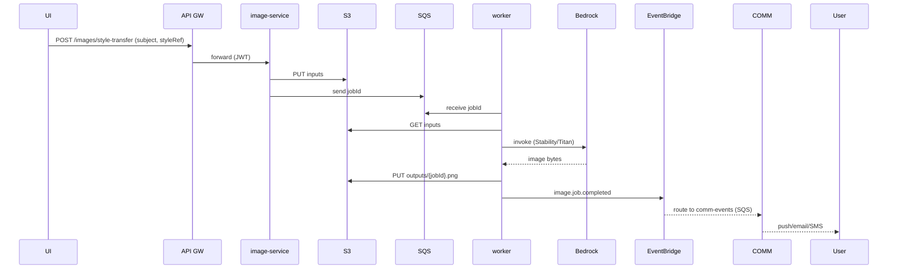

# 🌩️ Glamme — AWS Production Architecture (Comprehensive Design)

> Version: 1.0 • Owner: Platform Eng • Status: Production-Ready Design  
> Scope: End-to-end cloud design for **Image**, **Matching**, **Booking**, **Ride**, **Shopping**, **Social**, **Communication**, **Auth**, **Reviews**, **Calendar**, **Payments** and **Notifications** — including resiliency, security, observability, CI/CD, DR.

---

## 0) Principles & SLOs

- **Zero-trust** and **least-privilege** IAM; per-service IAM Roles; scoped KMS keys.
- **Async-first** for long jobs (image gen/edit, notifications, analytics).
- **Multi-AZ** for all stateful tiers; **cross-region DR** for RTO ≤ 60 min, RPO ≤ 5 min.
- **SLOs** (example): P99 API latency < 800 ms; Error budget 0.5%; Availability ≥ 99.9% (core), ≥ 99.5% (non-core).
- **Cost-aware**: serverless where bursty; lifecycle policies; right-sizing; budgets & alerts.

---

## 1) High-Level Architecture

```mermaid
flowchart LR
  subgraph Edge["Edge"]
    CF[CloudFront] -- static assets --> S3UI[(S3 UI Bucket)]
    CF --> WAF[WAF + Shield]
    CF --> APIGW[API Gateway HTTP APIs]
  end

  WAF -.-> BOT[Managed Bot Control]
  APIGW -- JWT/Cognito --> COG[Cognito User Pool + Federated IdPs]

  subgraph VPC["VPC (3 AZs)"]
    APIGW -->|VPC Link| NLB[NLB]
    NLB --> ALB[ALB (internal)]
    ALB --> ECSF[ECS Fargate Services]

    subgraph Microservices
      ECSF --> AUTH[auth-service]
      ECSF --> IMG[image-service]
      ECSF --> MATCH[matching-service]
      ECSF --> BOOK[booking-service]
      ECSF --> RIDE[ride-service]
      ECSF --> SHOP[shopping-service]
      ECSF --> COMM[communication-service]
      ECSF --> SOCIAL[social-service]
      ECSF --> REVIEW[review-service]
      ECSF --> UIAPI[ui-client-api]
    end

    RDS[(Aurora PostgreSQL Serverless v2)]
    REDIS[(ElastiCache Redis Cluster)]
    OS[(OpenSearch Serverless)]
    S3A[(S3: media/images)]
    S3P[(S3: product images)]
    S3L[(S3: logs/analytics)]
    KMS[(KMS: per-domain CMKs)]
  end

  IMG -- invoke --> BEDROCK[Amazon Bedrock (Titan/Stability)]
  IMG -- optional --> SAGEMAKER[SageMaker (Hair Segmentation)]
  IMG -- async --> SQSIMG[SQS image-jobs]
  IMG --> EB[EventBridge Bus]
  EB --> SQS_COMM[SQS comm-events]
  EB --> SQS_SOCIAL[SQS social-events]
  EB --> SQS_BOOK[SQS booking-events]
  COMM --> SNS[Amazon SNS / Pinpoint / SES]
  COMM --> CHIME[Amazon Chime SDK]

  SHOP --> STRIPE[Stripe]
  SHOP --> EASYPOST[EasyPost]
  RIDE --> STRIPE
  RIDE --> UBER[Uber API]
  RIDE --> LYFT[Lyft API]

  LOGS[CloudWatch Logs] <--> ECSF
  TRACES[X-Ray / OpenTelemetry] <--> ECSF
  METRICS[CloudWatch Metrics] <--> ECSF

  CF -. signed URLs .-> S3A
```

---

## 2) Networking & Security

### 2.1 VPC Topology
- **1 VPC**, **3 public** + **6 private** subnets (app/data split) across **3 AZs**.
- **NAT Gateways** per AZ for egress from private subnets.
- **VPC Endpoints** (S3, SQS, EventBridge, Secrets Manager, STS, CloudWatch Logs, Bedrock) keep traffic in AWS.
- **Routing**: Internet Gateway for public, NAT for private; NACLs default-deny + least rules.

### 2.2 Load & Ingress
- **CloudFront** for UI & media; **Origin Access Control** to S3.
- **WAF (with Shield Advanced)** in front of CloudFront & API Gateway.
  - AWS Managed RuleSets, rate-based rules, Bot Control, IP reputation lists.
- **API Gateway (HTTP APIs)** → **VPC Link** → **NLB** → **ALB** → **ECS services**.

### 2.3 IAM, Secrets & KMS
- **Per-service IAM task roles**, scoped to S3 prefixes, queues, Bedrock APIs, etc.
- **Secrets Manager** for Stripe, EasyPost, Uber/Lyft, OAuth IdPs, etc.
- **KMS CMKs**: `kms/media`, `kms/db`, `kms/app` (per env). SSE-KMS for S3, Aurora, OpenSearch, EBS.

---

## 3) Compute & Runtime

- **ECS on Fargate** (mix on-demand + Spot):
  - **AutoScaling** by CPU/RAM and custom metrics (P90 latency).
  - **Deployments**: CodeDeploy blue/green with pre-/post-traffic hooks; rollback on alarm.
  - Optional **App Mesh** for mTLS and traffic-shifting experiments.
- **ECR** for images with scanning; immutable tags.

---

## 4) Data Layer

### 4.1 Aurora PostgreSQL Serverless v2
- Multi-AZ, serverless capacity range tuned per env.
- **Aurora Global Database** (optional) for cross-region DR.
- PITR 7–30d; **AWS Backup** vault with daily snapshots.
- Performance Insights enabled; parameter group tuned for pooled JDBC.

### 4.2 ElastiCache Redis
- Cluster mode enabled; multi-AZ.
- Use cases: session cache, hot card caches, **rate limits**, **idempotency keys**, geo-index (driver coords).

### 4.3 OpenSearch Serverless
- Collections: `stylists`, `posts`, `hashtags`, `products`.
- Used by search and social discovery; ingest via EventBridge or MSK.

### 4.4 S3 Buckets
- `glamme-ui` (static UI) — CF origin; OAC; versioned.
- `glamme-media` — user media (images/videos), **private**; presigned uploads; signed URLs via CF.
- `glamme-product-media` — product images; private + presigned uploads.
- `glamme-logs`, `glamme-analytics` — log archive, analytics landing.
- Lifecycle: Intelligent-Tiering (media); Glacier for older logs.

---

## 5) Identity & Access

### 5.1 Cognito
- **User Pool** + **Hosted UI**; Federation: Google, Apple, Facebook, Amazon.
- App clients for web/mobile; refresh tokens 30d.
- Claims: `roles` (`ROLE_USER`, `ROLE_STYLIST`, `ROLE_ADMIN`), `plan` (`FREE`, `PRO`).
- **PreToken Lambda** injects plan/role claims from DB.

### 5.2 API Authorization
- **JWT authorizer** in API Gateway; scopes per service (`images:write`, `orders:read`, etc.).
- In microservices, Spring Security validates JWT and enforces method-level roles.

### 5.3 External OAuth (Calendars)
- Tokens stored encrypted (KMS column-level encryption); rotation/revocation endpoints.

---

## 6) Image Platform (Bedrock + SQS + EventBridge + SageMaker)

### 6.1 Providers
- **Amazon Titan Image Generator**: text→image, **inpainting**, **conditioning**.
- **Stability (Stable Image / SD3)** on Bedrock: image→image, masked edits.
- Configurable default provider; request can specify provider.

### 6.2 Async Processing
- `image-service` accepts job → stores inputs (S3) → **SQS** `image-jobs` → worker pulls → calls Bedrock → writes output (S3) → **EventBridge** `image.job.completed`.

### 6.3 Optional Hair Mask (SageMaker)
- If mask not supplied: call **SageMaker Runtime** (custom endpoint) to produce hair mask (PNG).

### 6.4 Storage & Access
- Inputs/outputs in `glamme-media` with structured keys (`uploads/{userId}/...`, `outputs/{jobId}.png`).
- CF signed URLs for delivery; URLs are never public.

### 6.5 Pseudocode — Worker
```pseudo
loop:
  msg = SQS.receive(image-jobs)
  job = DB.get(msg.jobId)
  try:
    DB.update(job, RUNNING)
    if job.type == INPAINT:
      src = S3.get(job.subjectKey)
      mask = job.maskKey ?: SageMaker.hairMask(src) if enabled
      out  = ProviderRouter.resolve(job.provider).editWithMask(src, mask, job.prompt, opts)
    elif job.type == STYLE_TRANSFER:
      subj = S3.get(job.subjectKey)
      ref  = S3.get(job.styleRefKey)
      out  = provider.transferStyle(subj, ref, job.prompt, opts)
    else:
      out  = provider.generateFromText(job.prompt, opts)

    key = save S3 outputs/{jobId}.png
    DB.update(job, SUCCEEDED, key)
    EventBridge.put("image.job.completed", {jobId, userId, key})
  except e:
    DB.update(job, FAILED, e.message)
    EventBridge.put("image.job.failed", {...})
  finally:
    SQS.delete(msg)
```

---

## 7) Events, Queues & Streaming

### 7.1 EventBridge
- Bus: `glamme-bus`; detail-types:
  - `image.job.completed|failed`
  - `booking.created|cancelled|completed`
  - `payment.captured|refunded`
  - `ride.requested|completed|cancelled`
  - `post.published`, `review.added`
- Rules route to per-service **SQS** queues and/or **Step Functions**.

### 7.2 SQS
- `image-jobs` (+ DLQ), `comm-events`, `social-events`, `booking-events` (+ DLQs).
- Redrive policies; alarms on DLQ depth.

### 7.3 Streaming (MSK)
- Topics: `rides.telemetry`, `social.activity`, `chat.messages`, `cdc.orders`, `cdc.users`.
- **Debezium** CDC from Aurora to MSK; sinks to S3/OpenSearch; consumers build projections.

### 7.4 Analytics
- (Option A) **Kinesis Firehose** → S3 → Athena/Glue for ad-hoc.
- (Option B) **Redshift Serverless** for BI dashboards (QuickSight).

---

## 8) Shopping & Payments

### 8.1 Stripe
- **PaymentIntent** (off-session for ride completion; on-session for checkout).
- Stripe customer mapping table; default PM; **idempotency keys** via Redis.
- **Webhooks**: Stripe → API Gateway → Lambda → SQS → order/ride services.

### 8.2 Shipping — EasyPost
- Rate shopping, label purchase; ship-to-customer/stylist/pickup.
- Address validation via EasyPost or **Amazon Location**.

### 8.3 Product Media & Search
- Product images to S3; presigned upload; CloudFront distribution.
- **OpenSearch** index for catalog + filters.

---

## 9) Ride-Hailing

- **Internal**: nearest-driver (Redis geo or Haversine).  
- **External**: Uber & Lyft (WebClient, retries, circuit breakers).
- **Billing**: Stripe on completion; webhooks reconcile.
- **Realtime**: Driver WS updates; optional API Gateway WebSockets for scale.
- **Telemetry**: Publish GPS to `rides.telemetry` (MSK).

---

## 10) Communication & Social

### 10.1 Communication
- **Amazon Chime SDK** for in-app voice/video; TURN relays managed by Chime.
- **Text chat** persisted in Aurora; emits to MSK for analytics/search enrichment.
- **Notifications**: SNS/Pinpoint (push/SMS); SES (email). Triggered by EventBridge.

### 10.2 Social
- Posts with media (S3+CF); likes, comments, repost, follow, block.
- **OpenSearch** for discovery & hashtags.
- **Redis** for hot timelines; fan-out precompute if scale requires (via MSK).

---

## 11) Matching & Reviews

- **Matching**: Gale–Shapley + Elo for ranking; filters by price range, distance, availability.  
  Precompute & cache scores in Redis; rebuild on events.
- **Reviews**: write model in Aurora; update Elo; emit `review.added`; denormalize aggregates.

---

## 12) Observability & Reliability

- **CloudWatch Logs**: JSON structure; subscription to Firehose → S3/OpenSearch.
- **Tracing**: X-Ray / OTel across services (propagate headers).
- **Metrics & Alarms**: latency, 5xx, queue depth, DLQ, Bedrock failures, webhook errors.
- **Dashboards**: per-service; global health.
- **Synthetics**: canaries (login, checkout, image job submit → complete).
- **Chaos** (lower env): AWS Fault Injection Simulator (FIS).

---

## 13) Security & Compliance

- WAF rules for OWASP Top 10; Bot Control; Shield Advanced.
- **CSP** headers and strict S3 bucket policies (no public ACLs).
- **PII minimization**; field-level encryption (KMS) for tokens/PHI-like data.
- **Audit logs** immutable (S3 Object Lock – governance).

---

## 14) CI/CD & Config

### 14.1 GitHub Actions
- **Build & Test**: unit/integration; SAST; dependency scans.
- **Docker Build** → **ECR** (immutable tags).
- **Infra Deploy**: CDK synth & deploy (per env; separate AWS accounts).
- **App Deploy**: ECS + CodeDeploy blue/green; canary 10% for 5 min → 100% if healthy.

### 14.2 AppConfig (Feature Flags)
- Flags: `images.provider.default`, `autoHairMask.enabled`, `chime.enabled`, `openSearch.feed.enabled`.
- Deployment strategies: **bake time + rollback** on errors.

---

## 15) DR & Backups

- **Aurora**: PITR + snapshots; (optional) Aurora Global Database (cross-region).
- **S3**: Cross-Region Replication for critical buckets; lifecycle+replication metrics.
- **OpenSearch**: snapshots to S3; documented restore process.
- **Redis**: RDB snapshots to S3; recreate cluster from snapshot.
- **Runbooks**: rehearse failover quarterly.

---

## 16) IAM Examples (Pseudocode Policies)

### 16.1 image-service task role (subset)
```json
{
  "Version": "2012-10-17",
  "Statement": [
    { "Effect": "Allow", "Action": ["bedrock:InvokeModel"], "Resource": [
        "arn:aws:bedrock:REGION:ACCOUNT:model/amazon.titan-image-generator-v1",
        "arn:aws:bedrock:REGION:ACCOUNT:model/stability.stable-image-ultra-v1"
    ]},
    { "Effect": "Allow", "Action": ["s3:PutObject","s3:GetObject"], "Resource": "arn:aws:s3:::glamme-media/*" },
    { "Effect": "Allow", "Action": ["sqs:SendMessage","sqs:ReceiveMessage","sqs:DeleteMessage"], "Resource": "arn:aws:sqs:REGION:ACCOUNT:image-jobs" },
    { "Effect": "Allow", "Action": ["events:PutEvents"], "Resource": "arn:aws:events:REGION:ACCOUNT:event-bus/glamme-bus" },
    { "Effect": "Allow", "Action": ["kms:Encrypt","kms:Decrypt"], "Resource": "arn:aws:kms:REGION:ACCOUNT:key/KMS_MEDIA_KEY_ID" }
  ]
}
```

---

## 17) API Patterns (Gateway → Private Services)

- JWT scopes per route; request/response mapping for consistent errors.
- **Idempotency**: `Idempotency-Key` header persisted in Redis for POST/charge/create.
- **Rate Limits**: API GW per-route throttles; per-plan limits in Redis (token bucket).

---

## 18) Detailed Flows

### 18.1 Image Style-by-Reference


### 18.2 Ride Completion Billing
```pseudo
on ride.completed(rideId, userId, amount):
  key = "idem:ride:"+rideId
  if redis.exists(key): return
  stripe.paymentIntent.create(confirm=true, off_session=true, idempotency_key=key, ...)
  redis.setex(key, 24h, "ok")
```

### 18.3 Matching (Elo + Gale–Shapley)
```pseudo
candidates = DB.findStylists(style, priceMin, priceMax, radius)
score = Elo*geoFactor*priceFactor*availability
return topN by score
```

---

## 19) Cost Controls & FinOps

- **AWS Budgets** + alerts; **tags** on all resources.
- **Right-size** Aurora serverless min ACU; ECS task sizes; CF caching.
- **S3 Lifecycle** & **Intelligent-Tiering**; Glacier Deep Archive for logs.

---

## 20) Deliverables via IaC (CDK)

- VPC/Subnets/NAT/VPC Endpoints.
- ECS Cluster/Services/TaskDefs; ALB/NLB; Target Groups.
- API Gateway (HTTP + optional WebSocket).
- CloudFront + WAF; OAC; Route 53.
- RDS Aurora + params; ElastiCache; OpenSearch.
- S3 buckets & policies; KMS CMKs.
- SQS Queues, EventBridge bus + rules.
- Chime & Pinpoint/SNS/SES wiring.
- Observability: Logs, Alarms, Dashboards, Synthetics.
- AppConfig Applications/Envs/Flags.
- Backup plans & vaults.
